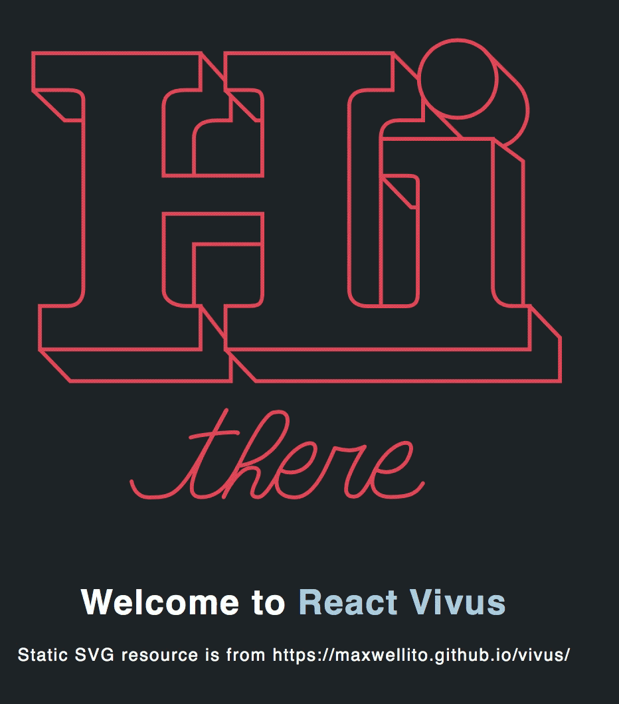

# React Vivus
[](https://www.npmjs.com/package/react-vivus)

[](https://www.npmjs.com/package/react-vivus)

This react component allows you to make drawing animation on SVG.

This component makes use of [vivus.js](https://github.com/maxwellito/vivus) plugin.



## Installation

To install this Component, run `yarn add react-vivus` or `npm install react-vivus --save`, Don't forget to install vivus by running `yarn add vivus` or `npm install vivus --save`.

## Usage

To use the component, In your react application just do

```javascript
import React from 'react';
import ReactVivus from 'react-vivus';
import svg from './example.svg';

const MyComponent = () => (
  <ReactVivus
    id="foo"
    option={{
      file: svg,
      animTimingFunction: 'EASE',
      type: 'oneByOne',
      onReady: console.log
    }}
    style={{ height: '100px', width: '100px' }}
    callback={console.log}
  />
);
export default MyComponent;

```

You can view all the different options to create a custom animation to draw your SVG in whatever way you like here https://github.com/maxwellito/vivus#option-list
